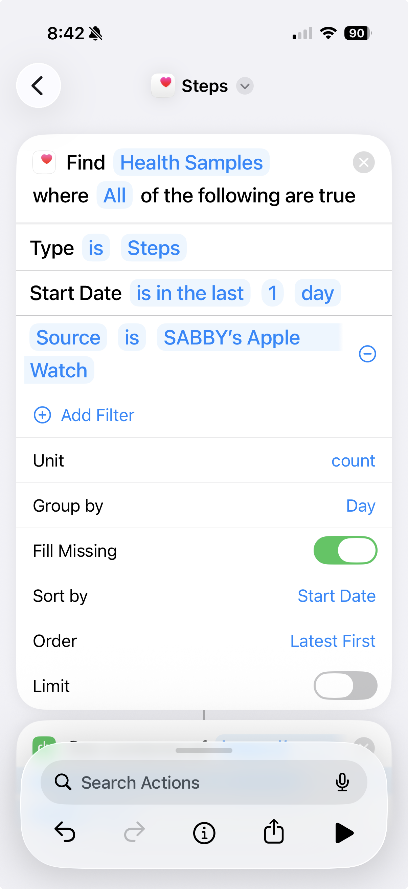

# Apple Health MCP Server

An MCP server that streams your Apple Health data to Claude. Say "GM" and get a personalized daily health briefing based on your HRV, sleep, heart rate zones, and training patterns.

## Why This Exists

I wanted Claude to understand my body. Not generic health advice. My HRV. My sleep. My training load. Every morning I say "GM" and Claude tells me how I'm actually doing and what I should do about it.

## The Stack

```
Apple Watch → iPhone Health App → iOS Shortcuts → Vercel → Upstash Redis → Claude (MCP)
```

**Why Vercel?** Native MCP support. Deploy a Python function, it speaks MCP. Done.

**Why Upstash Redis?** Serverless Redis with a REST API. Free tier is generous. No infrastructure to manage. Data stays yours.

**Why iOS Shortcuts?** No app to build. Shortcuts can query HealthKit and POST to an API. Janky? A little. Works? Perfectly.

## What You Get

Every morning, Claude gives you:

- **Recovery read**: HRV vs your 14-day baseline, sleep quality, resting HR
- **Training guidance**: Push, maintain, or back off based on your body's signals
- **Watch-outs**: Patterns worth monitoring
- **Day outlook**: How you'll likely feel

<details>
<summary>Example Output</summary>


</details>

## Setup (15 minutes)

### 1. Upstash Redis

1. Go to [upstash.com](https://upstash.com), create account
2. Create a Redis database (free tier)
3. Grab the REST URL and token

### 2. Deploy to Vercel

1. Fork this repo
2. Go to [vercel.com/new](https://vercel.com/new), import your fork
3. Add these environment variables:

| Variable | What it is |
|----------|------------|
| `UPSTASH_REDIS_REST_URL` | From Upstash dashboard |
| `UPSTASH_REDIS_REST_TOKEN` | From Upstash dashboard |
| `API_KEY` | Run `openssl rand -hex 32` |
| `MCP_SECRET` | Run `openssl rand -hex 16` |
| `EXERCISE_DAYS_PER_WEEK` | Optional. e.g., `strength:4,yoga:7,cardio:2` |

4. Deploy. That's it.

<details>
<summary>Vercel Environment Variables</summary>


</details>

### 3. iOS Shortcuts

You'll create individual shortcuts for each health metric, then a master shortcut that runs them all.

**Sub-shortcuts (one per metric):**

Each sub-shortcut does two things:
1. **Find Health Samples** - Query a specific metric for the last 24 hours
2. **Get Contents of URL** - POST to `https://your-app.vercel.app/api/ingest`
   - Method: POST
   - Headers: `Authorization: Bearer YOUR_API_KEY`
   - Body: Form encoded, with field name matching the metric

**Critical configuration:**

| Field name | Health metric | Group by: Day | Source Filter |
|------------|---------------|---------------|---------------|
| `steps` | Step Count | YES | Your Apple Watch |
| `exercise` | Exercise Minutes | YES | Your Apple Watch |
| `activeEnergy` | Active Energy | YES | Your Apple Watch |
| `hrv` | Heart Rate Variability | NO | None |
| `heartRate` | Heart Rate | NO | None |
| `respRate` | Respiratory Rate | NO | None |
| `sleep` | Sleep Analysis | NO | None |

**Why this matters:**

Cumulative metrics (steps, exercise, active energy) need special handling:
- **Group by: Day** aggregates readings into daily totals instead of individual samples
- **Source Filter** prevents double-counting. Without it, iOS returns readings from both iPhone and Apple Watch, inflating totals by ~20%

Discrete metrics (HRV, heart rate, respiratory rate) should NOT use grouping. They need individual samples for proper avg/min/max calculations.

<details>
<summary>Sub-shortcut Example</summary>


</details>

<details>
<summary>Steps Shortcut with Group by Day + Source Filter</summary>



</details>

**Master shortcut:**

Create a master shortcut that calls all your sub-shortcuts in sequence. This is what you'll run each morning.

<details>
<summary>Master Shortcut</summary>


</details>

**Automation (semi-automated):**

You can schedule the master shortcut to run daily. Go to Shortcuts → Automation → Create Personal Automation → Time of Day.

**Important limitation:** iOS requires confirmation for health data access. The automation will prompt you to tap "Run" each morning. It cannot run fully automatically. Your phone must be unlocked, and you cannot trigger it from your Apple Watch.

<details>
<summary>Automation Setup</summary>


</details>

**One more thing:** Go to Settings → Shortcuts → Advanced → Enable "Allow Sharing Large Amounts of Data". Otherwise iOS blocks large health exports.

Run your shortcuts once. Check your data is flowing: `https://your-app.vercel.app/api/data?days=1` (add your API key as Bearer token).

### 4. Connect Claude

Add the MCP server in Claude's settings under Connectors:

```json
{
  "mcpServers": {
    "health": {
      "url": "https://your-app.vercel.app/api/mcp?key=YOUR_MCP_SECRET"
    }
  }
}
```

<details>
<summary>Claude MCP Connector</summary>


</details>

### 5. System Instructions

Add this to your Claude project. Customize the "ABOUT ME" section for you.

```
When I say "GM" or "good morning", check my health data and brief me on my day.

ABOUT ME:
- 40s, focused on longevity and consistent training
- I track HRV as my primary recovery signal
- I'd rather undertrain than overtrain

WHAT I NEED FROM YOU:
1. Recovery read: How is my body doing? Compare yesterday's metrics vs baseline.
2. Training guidance: What should I do today? Push, maintain, or back off?
3. Watch-outs: Anything I should avoid or pay attention to?
4. Day outlook: How will I likely feel? What can I expect?

HOW TO REASON:
- Yesterday's data is your primary source. My shortcut syncs the previous day's data each morning, so "today" will always be empty. Don't mention missing today data.
- Look at yesterday's HRV vs baseline (negative % = below normal, needs attention)
- Look at recent_days for my training cycle. Low exercise_min (<30) = rest day, high (>60) = training day. Missing days = phone locked, no sync.
- Look at hr_zones for training intensity. High "hard"/"max" percentage = intense session. High "rest" = easy day or no workout.
- Look at yesterday's sleep quality (fragmentation, deep sleep, REM)
- Look at resting HR trend (elevated = accumulated fatigue)
- Correlate signals across recent_days. One bad metric isn't the story, patterns are.

Keep it tight. 6-8 lines max. No disclaimers. Be direct.
```

## How It Works

Claude gets raw data. No scores. No pre-computed "recovery status." Just numbers.

The magic is letting the LLM reason. It notices things like:
- "HRV down but you had two hard days, that's expected adaptation"
- "Resting HR crept up 6 bpm this week, watch for accumulated fatigue"
- "Sleep fragmentation high but architecture is fine, you're okay"

## MCP Tools

| Tool | What it does |
|------|--------------|
| `get_today` | All raw metrics for today |
| `get_trends` | Multi-day view (default 7 days) |
| `get_recovery_status` | HRV vs baseline + last 3 days of training context |

## Troubleshooting

**Steps/exercise showing wrong values?**
- Verify "Group by: Day" is enabled for cumulative metrics (steps, exercise, activeEnergy)
- Verify Source Filter is set to your Apple Watch name
- Without these settings, you get sample counts instead of totals, and double-counted values

**Heart rate showing absurdly high values (e.g., 26,000)?**
- You accidentally enabled "Group by: Day" on a discrete metric
- Remove grouping from HRV, heartRate, and respRate shortcuts

**Data not matching Apple Health exactly?**
- HRV may differ slightly. Apple shows specific readings, we average all samples.
- Steps/exercise should match exactly with correct shortcut configuration.

**"No data synced today" error?**
- This is expected. Your shortcuts sync yesterday's data. Use `get_recovery_status` which includes `recent_days`.

## Security

`API_KEY` protects ingest, `MCP_SECRET` protects the MCP endpoint. Basic protection. If you leak a key, rotate it in Vercel and update your shortcuts.

## Your Data

Everything lives in your Upstash Redis. Nothing shared. Keys are `health:YYYY-MM-DD`.

## Inspiration

Inspired by [whoop-mcp-server](https://github.com/yuridivonis/whoop-mcp-server) by Yuri Divonis. Similar idea, different data source. This one uses Apple Watch data via iOS Shortcuts instead of WHOOP's API. No subscription required.
